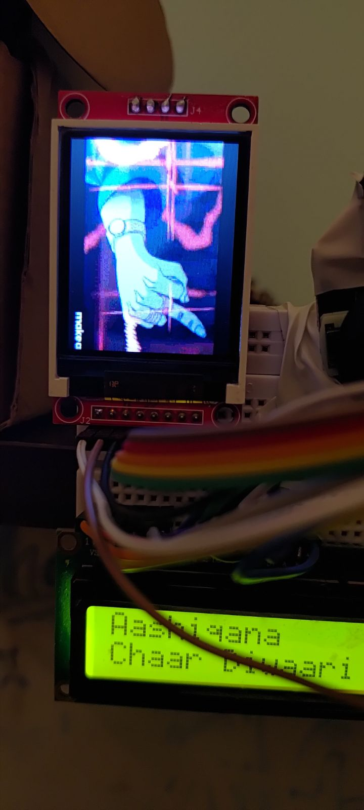

# Spotify Pico Display - Pinout

MCU: Raspberry Pi Pico 2 W

## LCD (LiquidCrystal - 4-bit mode)

| Function | GPIO |
|----------|------|
| RS       | 2    |
| EN       | 3    |
| D4       | 4    |
| D5       | 5    |
| D6       | 6    |
| D7       | 7    |

## Joystick (Analog)

| Function | GPIO | Notes        |
|----------|------|--------------|
| X        | 26   | ADC0         |
| Y        | 27   | ADC1         |
| SW       | 22   | INPUT_PULLUP |

## TFT Display (ST7735 - SPI)

| Function | GPIO |
|----------|------|
| CS       | 17   |
| DC       | 20   |
| RST      | 21   |
| SCK      | 18   |
| MOSI     | 19   |
| MISO     | 16   |

## Notes

the temporary gif display is done using https://github.com/bitbank2/image_to_c 
